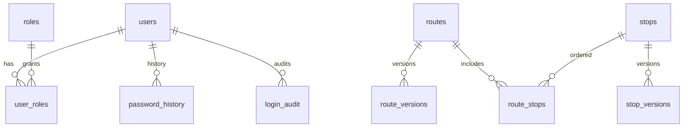

# Data model ERD (reference)

This document summarizes the canonical entity groups for PostgreSQL. Detailed columns evolve with Flyway migrations under `backend/src/main/resources/db/migration/`.

## Identity and audit

- `users` — local accounts (username, password hash, enabled flags, timestamps).
- `roles`, `user_roles` — RBAC mapping.
- `password_history` — prior hashes for rotation policy (Phase 2+).
- `login_audit` — login attempts and outcomes.

## Transit and integration

- `routes`, `route_versions`, `stops`, `stop_versions`, `route_stops`, `schedules`.
- `source_import_jobs`, `field_mappings` — ETL and template versioning.

## Search and ranking

- `search_events`, `stop_popularity_metrics`, `ranking_config`.

## Passenger and messaging

- `passenger_reservations`, `passenger_checkins`, `reminder_preferences`, `do_not_disturb_windows`.
- `message_queue`, `message_queue_attempts`, `messages`, `message_redaction_rules`.

## Workflow

- `workflow_definitions`, `workflow_instances`, `workflow_tasks`, `workflow_escalations`.

## Cleaning and configuration

- `cleaning_rule_sets`, `cleaning_audit_logs`, `field_standard_dictionaries`.

## Operations

- `system_alerts`, `diagnostic_reports`.

## Diagram (high level)

Phases 0–2 implement the **identity and audit** tables required for authentication and RBAC seeds. Phase 3 adds **transit and integration** tables (`routes`, `route_versions`, `stops`, `stop_versions`, `route_stops`, `schedules`, `source_import_jobs`, `field_mappings`). Phase 4 adds **search and ranking** tables (`search_events`, `stop_popularity_metrics`, `ranking_config`). Phase 5 adds **passenger and messaging** tables (`passenger_reservations`, `passenger_checkins`, `reminder_preferences`, `do_not_disturb_windows`, `messages`, `message_queue`, `message_queue_attempts`, `message_redaction_rules`). Phase 6 adds **workflow** tables (`workflow_definitions`, `workflow_instances`, `workflow_tasks`, `workflow_escalations`). Phase 7 adds **cleaning and configuration** tables (`cleaning_rule_sets`, `cleaning_audit_logs`, `field_standard_dictionaries`). Phase 8 adds **operations** tables (`system_alerts`, `diagnostic_reports`).
